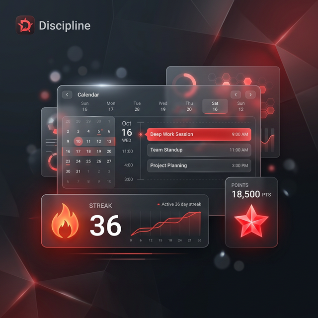
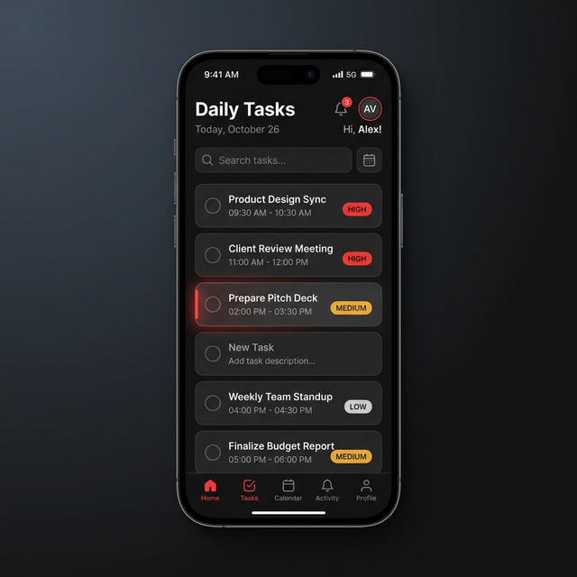
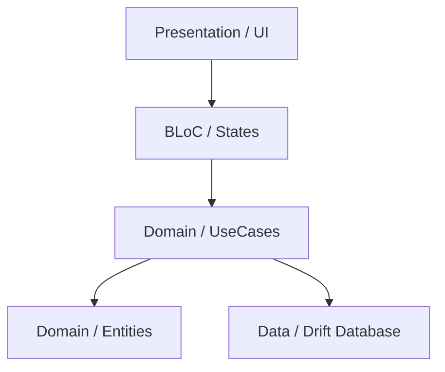
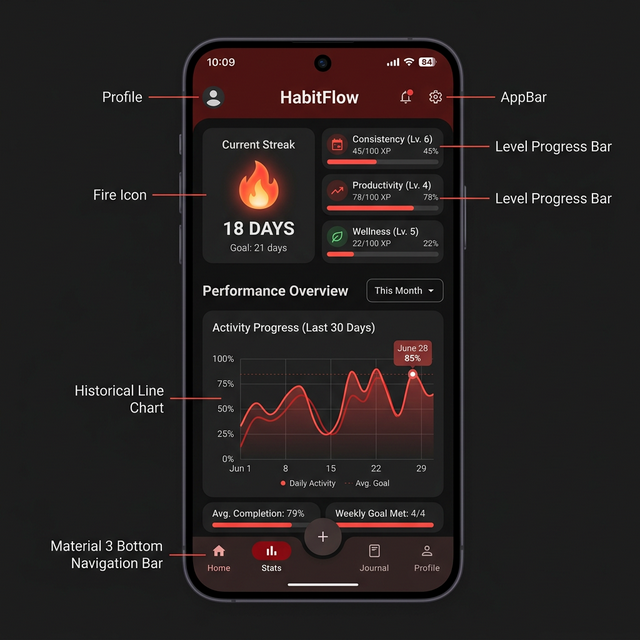

# Discipline (Дисциплина) 🚀



[](https://flutter.dev)
[](https://dart.dev)
[](https://blog.cleancoder.com/uncle-bob/2012/08/13/the-clean-architecture.html)
[](https://opensource.org/licenses/MIT)

**Discipline** — это современное приложение для управления задачами и формирования привычек, созданное для тех, кто ценит строгую дисциплину и визуальный прогресс. 

---

## ✨ Основные Возможности

### 🧠 Умная Логика Повторений
Никаких "просто ежедневных" задач (хотя они тоже есть). Наш движок поддерживает:
*   **WEEKLY**: Выбирайте конкретные дни недели (Пн/Ср/Пт).
*   **INTERVAL**: Планируйте задачи раз в N дней.
*   **ONE_TIME**: Быстрые разовые дела, привязанные к календарю.

### 📈 Продвинутая Статистика и Геймификация
*   **Streak (🔥 Огонь)**: Ваша серия дней без пропусков постоянных задач.
*   **Баллы и Уровни**: За каждую выполненную задачу вы получаете очки. Прокачивайте свой уровень дисциплины!
*   **История 14 дней**: Наглядный календарный вид ваших успехов и пропусков.

### 💎 Премиальный UI/UX
*   **Material 3 Design**: Тёмная тема с аккуратными акцентами `RedAccent`.
*   **Плавные Анимации**: Мягкое зачеркивание текста и анимированные чекбоксы.
*   **Удобство ввода**: Оптимизированное время (Input Mode) для работы в любых условиях.



---

## 🛠 Технологический Стек

| Компонент | Технология |
| :--- | :--- |
| **Framework** | [Flutter](https://flutter.dev) |
| **State Management** | [flutter_bloc](https://pub.dev/packages/flutter_bloc) |
| **Persistence** | [Drift (SQLite)](https://drift.simonbinder.eu/) |
| **DI** | [GetIt](https://pub.dev/packages/get_it) |
| **Architecture** | Clean Architecture (Domain, Data, Presentation) |

---

## 🏗 Архитектура

Приложение построено по принципам **Clean Architecture**:



---

## 🚀 Начало Работы

### Требования
*   Flutter SDK (3.x+)
*   Dart SDK

### Установка
1. Клонируйте репозиторий:
   ```bash
   git clone https://github.com/F0nkell/F.O.K.us_Mobile.git
   ```
2. Подтяните зависимости:
   ```bash
   flutter pub get
   ```
3. Сгенерируйте файлы базы данных:
   ```bash
   dart run build_runner build
   ```
4. Запустите приложение:
   ```bash
   flutter run
   ```

---

## 📸 Скриншоты

<table border="0">
 <tr>
    <td></td>
    <td></td>
 </tr>
</table>

---

## 📝 Лицензия

Распространяется под лицензией MIT. Подробности в [LICENSE](LICENSE).

---
*Разработано с ❤️ от F0nkell для настоящих воинов дисциплины.*
